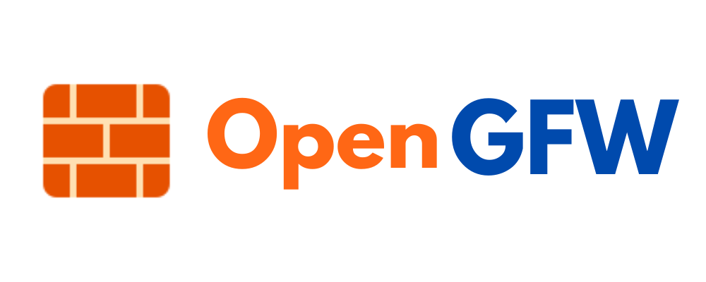

# 

Free and open-source censorship for everyone.

[The Great Firewall of China](https://en.wikipedia.org/wiki/Great_Firewall) is arguably the largest Internet censorship system in the world. It is technically an interesting and sophisticated system that includes real-time analysis and blocking/hijacking of various protocols, active probing of proxies & VPNs, TLS MITM attack and many more on a mass scale. Why letting only the Chinese government have this capability? With this project, you can now easily deploy your own GFW on your home network to, say, block your kids from using TikTok!

## Supported Platforms

Linux devices. Including but not limited to OpenWrt / DD-WRT.

## Planned Features

- [ ] DNS poisoning
- [ ] DNSSEC blocking
- [ ] HTTP domain/URL/keyword-based blocking
- [ ] HTTPS cert/SNI-based blocking
- [ ] HTTPS ESNI blocking
- [ ] HTTP proxy/SOCKS blocking
- [ ] HTTPS proxy probing & blocking
- [ ] SSH tunnel probing & blocking
- [ ] WireGuard blocking
- [ ] Tor blocking
- [ ] OpenVPN probing & blocking
- [ ] Shadowsocks probing & blocking
- [ ] TLS MITM attack

Feel free to tell me more about your idea.

## Why?

For fun. And it's how I learn computer networking. Even better if it's actually useful to you.